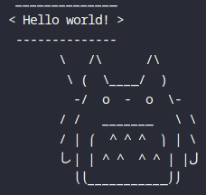

# totorosay


[](LICENSE)

cowsay but with totoro


Insipired by cowsay, but instead of a cow, Totoro says something.

## Installation

TODO

## Usage

Open your favourite Terminal and type:

```bash
totorosay Hello world!
```

And Totoro says `Hello world!`.

Use the `-b` or `--big` flag to use **big** Totoro:


